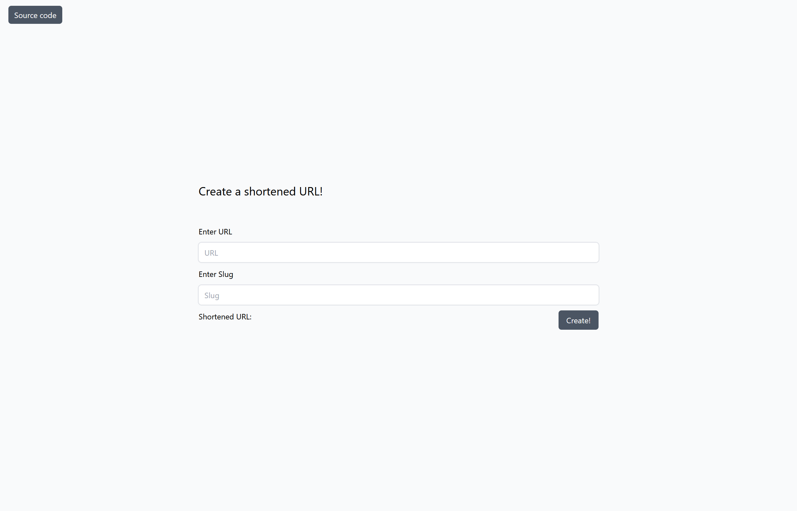

# FaunaDB URL shortener

A simple URL shortener using next.js, FaunaDB and tailwindcss

## Screenshot

## What I learned

- How to use tailwindcss
- Theme switcher with localStorage
- Better understanding of FaunaDB
